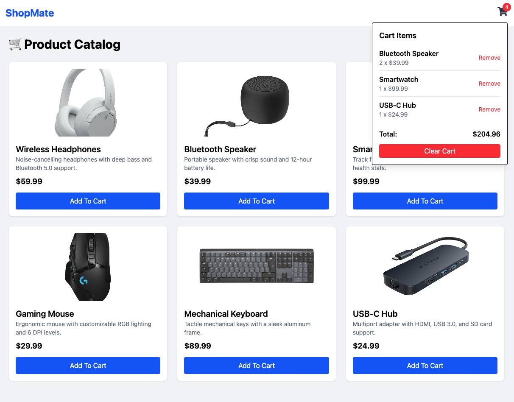

# 🛒 ShopMate - Catalog Shopping App

### Live Demo :

[https://shopmate.ahmedrehandev.net](https://shopmate.ahmedrehandev.net)

**ShopMate** is a fully functional catalog shopping application built using modern React development.The app demonstrates a real-world use case where users can browse a list of products, add them to a shopping cart, and see a dynamically updating total.

---

### 🔧 Features & Functionality :

- Product listing page with real-time data fetched from a JSON server
- Shopping cart system with quantity management and automatic total calculation
- Centralized state using React’s Context API for cleaner data flow
- Loading state and user feedback via spinner components
- Clean and responsive UI using Tailwind CSS
- Component-based architecture for easy scalability and reusability

---

### 📸 Screenshot :



---

### 🧠 Concepts Added :

- useState and useEffect hooks for handling state and side effects
- Context API for managing global state
- Component composition and props drilling minimization
- Handling async operations with error management
- Tailwind utility-first CSS for fast, responsive styling

---

### 🚀 Getting Started :

Install Dependencies

```
npm install
```

Run project

```
npm run dev
```

---

### 📜 License :

This project is licensed under the MIT License.

MIT License

Copyright © 2025 Ahmed
